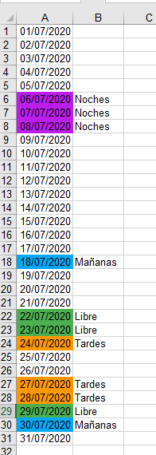

# MisTurnos App 
 

MisTurnos work shift calendar app done in Java compatible with Android devices. 

## Features
* Multiple days selection at one time.
* Add work shift event (free, morning, afternoon, night) to each day. 
* Custom event style: dot or colored cell.
* Custom color category.
* Export month selected to XLS format.
* Share calendar XLS to other apps / attach file as email attachment.

## Dependencies
* [Dagger 2](https://github.com/google/dagger)
* [Butter Knife](https://github.com/JakeWharton/butterknife)
* [Material-Calendarview](https://github.com/prolificinteractive/material-calendarview)
* [Gson](https://github.com/google/gson)
* [Jexcelapi](https://mvnrepository.com/artifact/net.sourceforge.jexcelapi/jxl/2.6.12)
* [ColorPicker](https://github.com/jaredrummler/ColorPicker)

## Demo
<h3 align="center">Main Screen Demo - Settings Screen</h3>

    
     
    

<h3 align="center">Settings Demo - Calendar XLS Example</h3>

    
    
    

## Support me

> Just **star** or **fork** this repository, and follow my github. You have _supported_ me!

## Author

[**David Mareca**](https://www.linkedin.com/in/davidme/)